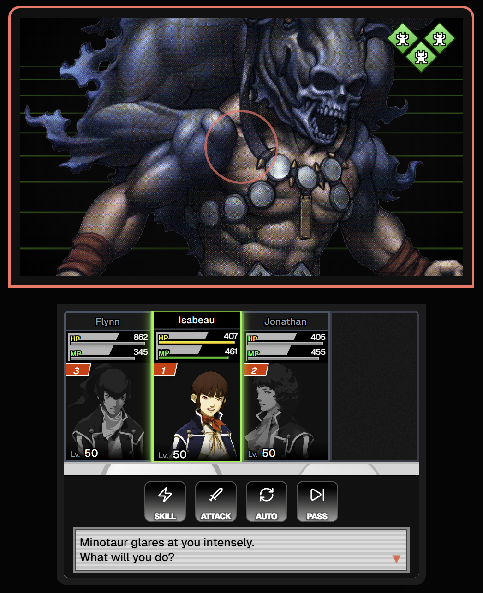

## Hi there 👋 I'm Chris!

🚀 Passionate apprentice software engineer | Coding enthusiast | Lifelong learner

🔭 I’m currently working on **a cross-platform fitness and workout log app**.

🌱 I’m currently learning **C++, Linux kernel inner-workings, ergonomic and intuitive UI creation, etc!**

👯 I’m looking to collaborate on **open source emulator projects**, **applications or software that use generative AI**

💬 Ask me about **the latest hardware trends, ARM architecture, recompilation of old software for newer platforms, UI design philosophy**

❌ DON'T ask me about **Memory Management, C, Compilation** (It's a touchy subject..)

📫 How to reach me: **christianmesina2002@gmail.com**

⚡ Fun fact: **I bench 100kg**

---

### 🛠️ My Tech Toolbox

- JavaScript/TypeScript 💻
- React/Redux ⚛️
- React Native 📱
- Node.js 💚
- Python 🐍
- Flask 🍶
- Java ♨️
- Spring Boot 🍃
- MySQL / SQLite

### 📈 My GitHub Stats

### 🏆 Some of My Projects

- **[DellLatitude5400Hackintosh]** – [OpenCore EFI folder for Dell Latitude 5400 allowing to install and use MacOS on said device]
- **[yourEfrei]** – [A school website allowing account creation with different roles (student, teacher, admin) allowing for consulting lessons, adding lessons, grades, etc. with authentication, security, SQLite Database, NodeJS back-end, React JS Front-end]
- **[OurAnimeList]** – [An anime list website containing multiple CRUDs, authentication, security and SQLite DB in Java Spring Boot]
- **[R&D at CGI France]** – [Transforming a scientific article into a real product - Data governing in data lakes - GDPR]
- **[Data Archival and Tracability System at (A major player in the optics field)]** – [A set of services, APIs and Flask application for ensuring proper access, archival, encryption, compression and tracability of some internal data streams]
- **[Sales aid website at (A major player in the optics field)]** – [A platform accessible by opticians containing product demos, information about products (designs, treatments, different materials) including API development, front-end development using NextJS (React) and Docker image creation using Dockerfiles and docker compose for enhanced deployment on different platforms]
- **[Healthcare Gift Compliance Web Application at (A major player in the optics field)]** – [A web application ensuring compliance with the French anti-gift law, featuring request submission, N+1 approval workflow via OTP and token, document validation, and status tracking, built with Flask, Python, deployed with Docker]
- **[SMT IV NextJS](https://demoxdev.github.io/smt4_react/)** – [A web-based recreation of the Shin Megami Tensei IV battle interface and mechanics, featuring authentic UI, turn-based combat, and the Press Turn system, built with Next.js 16, React 19, and Tailwind CSS 4]
   
  

Let's connect and build the future together! 🤝
